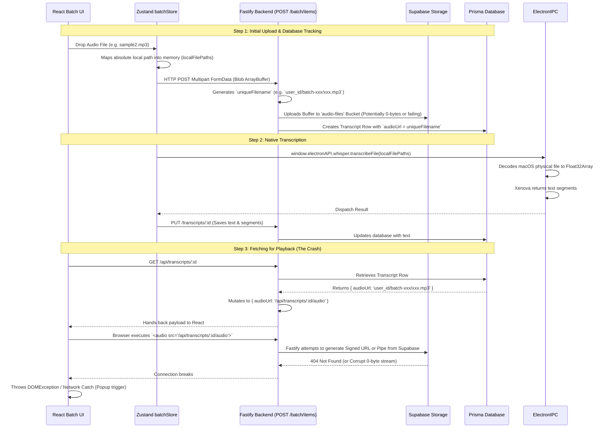

# Current Audio Insertion Architecture (Pre-Audit)

This diagram maps out exactly what the application is currently doing when you drag and drop a file into the Batch Jobs UI, showing the exact pipeline that populates the `audioUrl` tracking string.

### Suspected Failure Points to Audit
1. **The Blob Buffer:** Is the React UI sending an empty Blob in the `FormData` during `batchStore.ts` upload?
2. **The Supabase Upload:** Is `uploadFile` succeeding, or secretly masking a 0-byte chunk?
3. **The Disconnect:** We are transcribing the local macOS HD file flawlessly offline, but relying on the generic Supabase cloud copy for Playback! Since this is an offline-first app, this entire database insertion step should likely bypass Supabase completely and just securely log the macOS local path.
