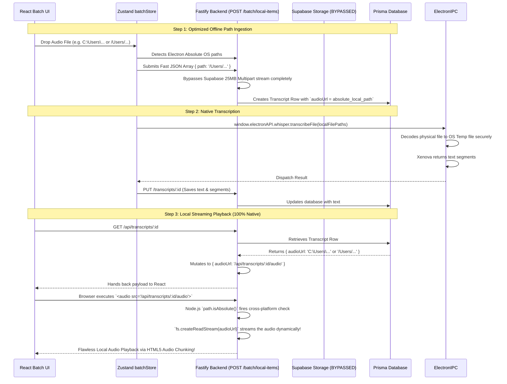

# Audio Insertion Architecture (Post-Audit Fix)

This diagram maps out the new, cross-platform Native Offline-first string ingestion workflow.

```mermaid
sequenceDiagram
    participant UI as React Batch UI
    participant Store as Zustand batchStore
    participant API as Fastify Backend (POST /batch/local-items)
    participant SB as Supabase Storage (BYPASSED)
    participant DB as Prisma Database

    %% Upload Phase (JSON path bypass)
    Note over UI, DB: Step 1: Optimized Offline Path Ingestion
    UI->>Store: Drop Audio File (e.g. C:\Users\... or /Users/...)
    Store->>API: Detects Electron Absolute OS paths
    Store->>API: Submits Fast JSON Array { path: '/Users/...' }
    
    API->>API: Bypasses Supabase 25MB Multipart stream completely
    API->>DB: Creates Transcript Row with `audioUrl = absolute_local_path` 
    
    %% Processing Phase
    Note over UI, DB: Step 2: Native Transcription
    Store->>ElectronIPC: window.electronAPI.whisper.transcribeFile(localFilePaths)
    ElectronIPC->>ElectronIPC: Decodes physical file to OS Temp file securely
    ElectronIPC->>ElectronIPC: Xenova returns text segments
    ElectronIPC-->>Store: Dispatch Result
    Store->>API: PUT /transcripts/:id (Saves text & segments)
    API->>DB: Updates database with text
    
    %% Playback Phase
    Note over UI, DB: Step 3: Local Streaming Playback (100% Native)
    UI->>API: GET /api/transcripts/:id
    API->>DB: Retrieves Transcript Row 
    DB-->>API: Returns { audioUrl: 'C:\Users\...' or '/Users/...' }
    API->>API: Mutates to { audioUrl: '/api/transcripts/:id/audio' }
    API-->>UI: Hands back payload to React
    UI->>API: Browser executes `<audio src="/api/transcripts/:id/audio">`
    API->>API: Node.js `path.isAbsolute()` fires cross-platform check
    API->>API: `fs.createReadStream(audioUrl)` streams the audio dynamically!
    API-->>UI: Flawless Local Audio Playback via HTML5 Audio Chunking!
```
