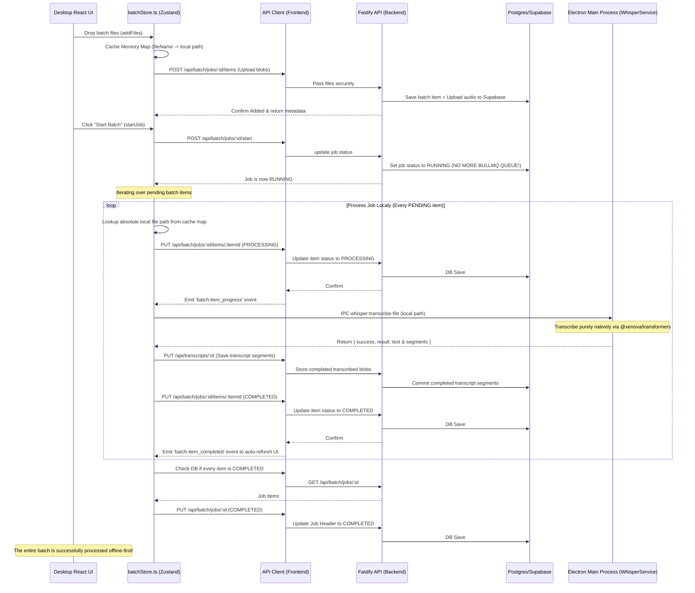

# Local Batch Processing Workflow (Xenova + Client-Side Orchestration)

This diagram illustrates the newly localized batch processing loop that completely bypasses the backend BullMQ/`whisper.cpp` queue, leveraging the native Electron Main Process iteratively powered by `transformers.js`.

