# VoiceFlow Pro: Local Batch Processing Architecture (Option A)

This document resolves the pipeline incompatibility issue where single files process locally via Xenova but batch items aggressively route through a decoupled backend queue. 

**Architectural Decision:** We will deprecate the backend BullMQ `batchQueue.ts` implementation to unify the application around the fast, cost-free Local Desktop Xenova engine. 

To accomplish this, we extract the "queue manager" concept directly into the React/Electron client, leveraging the IPC handlers we just established.

## Workflow Sequence

```mermaid
sequenceDiagram
    autonumber
    
    actor User
    participant BatchStore as React (batchStore.ts)
    participant UI as React (batch-processor.tsx)
    participant Electron as Electron Main (WhisperService)
    participant API as Backend API (Supabase)

    User->>UI: Selects "Start Batch Job"
    UI->>BatchStore: processJobLocally(jobId)
    
    rect rgb(23, 32, 42)
        Note right of BatchStore: 1) Job Setup
        BatchStore->>API: GET /api/batch/jobs/{jobId}/items
        API-->>BatchStore: Returns array of [PENDING] audio files
        BatchStore->>API: PUT /api/batch/jobs/{jobId} (status: RUNNING)
    end

    rect rgb(11, 41, 19)
        Note right of BatchStore: 2) The Native Iteration Loop
        loop For Each Pending Item
            BatchStore->>API: Mark item as PROCESSING
            
            Note right of BatchStore: Trigger Native IPC!
            BatchStore->>Electron: window.electronAPI.whisper.transcribeFile(item.path)
            
            Electron->>Electron: Loads local Xenova Model
            Electron->>Electron: Unpacks & Inferences Audio
            Electron-->>BatchStore: Returns { success: true, text, segments }
            
            BatchStore->>API: Mark item COMPLETED & Save Segments
            BatchStore->>UI: Update Process Bar (x% complete)
        end
    end
    
    rect rgb(23, 32, 42)
        Note right of BatchStore: 3) Finalizing
        BatchStore->>API: PUT /api/batch/jobs/{jobId} (status: COMPLETED)
        BatchStore-->>UI: Display Success / Review Phase
    end
```

## Why Option A is Superior

1. **Unifies the Codebase:** We eliminate having to maintain two completely separate Whisper architectures (Xenova vs whisper.cpp).
2. **Offline Resilience:** React holds total state control over what item is executing, gracefully handling if the user pauses or closes the system.
3. **No Backend Spikes:** Instead of hammering a backend server simultaneously with 50 files crashing BullMQ or memory limits, a recursive React function throttles the inference through the native CPU using Xenova one file at a time at precisely the hardware's pace.
