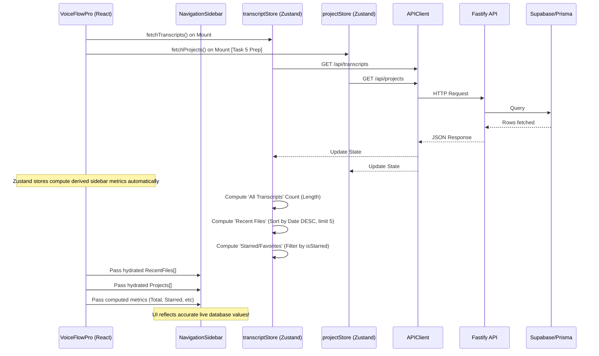

# Dashboard Sidebar Data Flow 

This diagram illustrates how the `NavigationSidebar` will transition from static mock data to dynamically fetching and computing live UI metrics from the Supabase backend via `apiClient`.

### Action Plan for Task 1:
1. Update `NavigationSidebar` props interface to accept dynamic numbers (`totalTranscripts`, `starredCount`, etc).
2. Hook up `useTranscriptStore()` in the main `VoiceFlowPro.tsx` parent.
3. Pass the derived arrays and counts downward as props into `<NavigationSidebar>`.
4. *Note on Projects:* Since full project CRUD management is scheduled for Task 5, we will temporarily supply an empty array directly from a newly scaffolded `projectStore`, setting us up perfectly for Task 5.
