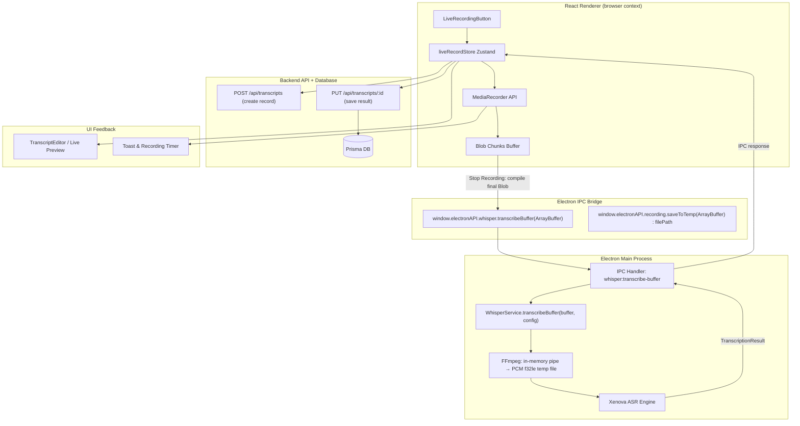
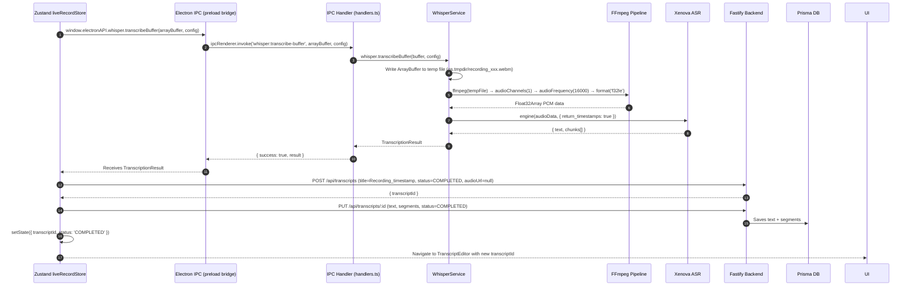

# Task 3: Live Recording — Architecture Design

> **Scope:** No code is written at this stage. This document defines the complete architecture for the real-time microphone recording and transcription feature, based on the existing codebase.

---

## 1. High-Level System Overview



---

## 2. Recording Phase — Sequence Diagram

> **What happens from the moment the user clicks "Record" to the moment they click "Stop".**

```mermaid
sequenceDiagram
    autonumber
    actor User
    participant UI as React UI (liveRecordStore)
    participant MediaRec as MediaRecorder (browser)
    participant Timer as Recording Timer UI
    participant Store as Zustand Store

    User->>UI: Clicks "Start Recording" button
    UI->>MediaRec: navigator.mediaDevices.getUserMedia({ audio: true })
    MediaRec-->>UI: MediaStream granted (or permission denied)

    alt Permission Denied
        UI-->>User: Show error toast "Microphone access denied"
    else Permission Granted
        UI->>Store: setState({ isRecording: true, startTime: Date.now() })
        UI->>MediaRec: new MediaRecorder(stream, { mimeType: 'audio/webm;codecs=opus' })
        UI->>MediaRec: recorder.start(1000)

        loop Every 1000ms
            MediaRec-->>Store: ondataavailable → push Blob to chunks[]
            Store-->>Timer: Update elapsed time display
        end

        User->>UI: Clicks "Stop Recording"
        UI->>MediaRec: recorder.stop()
        MediaRec-->>Store: onstop → compile final Blob from chunks[]
        Store->>Store: setState({ isRecording: false, finalBlob: Blob })
        UI-->>User: Show "Processing..." state
    end
```

---

## 3. Transcription Phase — Sequence Diagram

> **What happens after "Stop": converting the recorded audio blob into a database transcript.**



---

## 4. State Machine — liveRecordStore

> **All possible states in the Zustand recording store.**

```mermaid
stateDiagram-v2
    [*] --> IDLE : App loads

    IDLE --> REQUESTING_MIC : User clicks Record
    REQUESTING_MIC --> IDLE : Permission denied
    REQUESTING_MIC --> RECORDING : Permission granted

    RECORDING --> PAUSED : User clicks Pause
    PAUSED --> RECORDING : User clicks Resume
    RECORDING --> STOPPING : User clicks Stop
    STOPPING --> TRANSCRIBING : Blob compiled

    TRANSCRIBING --> SAVING : Xenova returns result
    SAVING --> COMPLETED : DB record created
    SAVING --> ERROR : API or IPC failure

    COMPLETED --> IDLE : User navigates away
    ERROR --> IDLE : User dismisses error

    RECORDING --> ERROR : Microphone disconnected
    TRANSCRIBING --> ERROR : Whisper engine failure
```



---

## 5. Component Architecture — What Gets Built

```mermaid
graph LR
    subgraph "New Files to Create"
        A["liveRecordStore.ts (Zustand)"]
        B["LiveRecordingPanel.tsx (UI Component)"]
        C["useMediaRecorder.ts (Custom Hook)"]
    end

    subgraph "Files to MODIFY"
        D["handlers.ts — add whisper:transcribe-buffer IPC handler"]
        E["whisperService.ts — add transcribeBuffer() method"]
        F["preload.ts — expose transcribeBuffer via contextBridge"]
        G["VoiceFlowPro.tsx — wire up Live Recording view/panel"]
    end

    subgraph "Existing Infrastructure (no changes)"]
        H["apiClient.ts — createTranscript() + updateTranscript()"]
        I["transcriptRoutes.ts — existing POST/PUT endpoints"]
        J["TranscriptEditor.tsx — receives completed transcript"]
    end

    A --> B
    C --> B
    B --> D
    D --> E
    E --> F
    B --> G
    A --> H
    H --> I
    I --> J
```

---

## 6. IPC Bridge Contract

> **New methods that must be added to the preload context bridge.**

| Channel | Direction | Payload | Response |
|---|---|---|---|
| `whisper:transcribe-buffer` | Renderer → Main | `{ buffer: ArrayBuffer, config: WhisperConfig }` | `{ success: boolean, result: TranscriptionResult }` |
| `whisper:recording-progress` | Main → Renderer | `{ jobId, stage, progress, message }` | — (event) |

---

## 7. Key Design Decisions

### 7.1 In-Memory vs Temp File for Audio Buffer
The existing `transcribeFile()` uses FFmpeg with a **temp PCM file** to avoid Node.js stream backpressure crashes (documented in `whisperService.ts:208`). The new `transcribeBuffer()` will follow the same pattern:
1. Write `ArrayBuffer` → temp `.webm` file in `os.tmpdir()`
2. Pipe through FFmpeg→ PCM temp file
3. Read PCM → Float32Array → Xenova
4. Delete both temp files

This avoids implementing a new streaming pipeline and reuses proven FFmpeg logic.

### 7.2 No Backend Audio Storage for Recordings
Unlike file uploads, live recordings will **not** be uploaded to Supabase. The `audioUrl` field in the database transcript record will be `null` for live recordings. Only the text + segments are persisted. This is consistent with the offline-first principle established in Tasks 2 and 2.5.

### 7.3 Pause/Resume Support
`MediaRecorder` natively supports `pause()` and `resume()`. Chunks collected before pause are preserved in the buffer. This is achievable with no extra complexity.

### 7.4 Browser Codec Compatibility
`audio/webm;codecs=opus` is supported on Electron (Chromium). FFmpeg handles webm/opus natively. No additional codec installation needed.

### 7.5 Microphone Permission in Electron
Electron requires `session.defaultSession.setPermissionRequestHandler` to allow `microphone` access. This must be configured in `windowManager.ts` (Main Process), not just in the renderer.

---

## 8. Implementation Checklist (for Step 2 Approval)

- [ ] **`WhisperService`**: Add `transcribeBuffer(buffer: Buffer, config)` method
- [ ] **`handlers.ts`**: Register `whisper:transcribe-buffer` IPC handler
- [ ] **`preload.ts`**: Expose `transcribeBuffer` via `contextBridge.exposeInMainWorld`
- [ ] **`windowManager.ts`**: Enable microphone permission in session handler
- [ ] **`liveRecordStore.ts`**: New Zustand store (IDLE → RECORDING → TRANSCRIBING → COMPLETED state machine)
- [ ] **`useMediaRecorder.ts`**: React hook wrapping `navigator.mediaDevices.getUserMedia` + `MediaRecorder`
- [ ] **`LiveRecordingPanel.tsx`**: UI component with record/pause/stop buttons, timer, waveform visualizer
- [ ] **`VoiceFlowPro.tsx`**: Hook up Live Recording panel to the main navigation/view system
