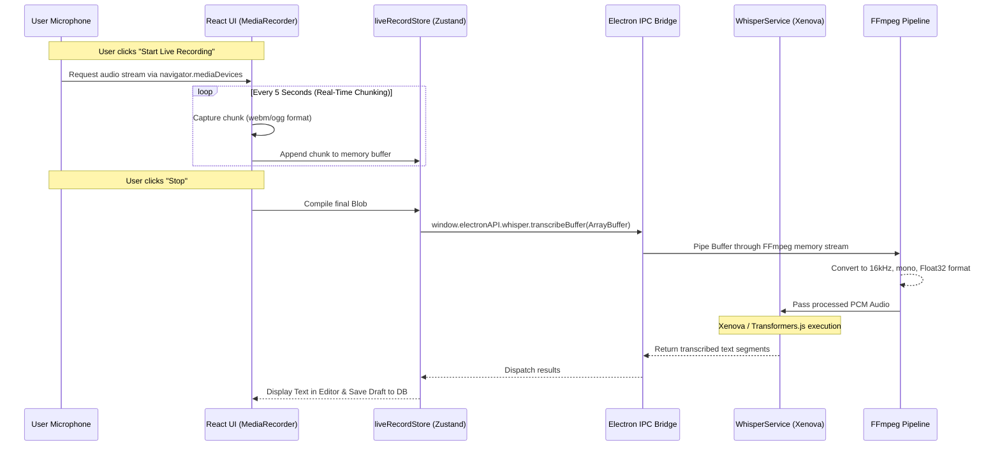

# Live Recording & Transcription Workflow

This sequence diagram explains how our native Desktop application will handle real-time microphone capture, routing it safely from the React browser context into the heavily optimized Electron Main process for transcription.

### Action Plan
1. Hook into the `navigator.mediaDevices.getUserMedia()` browser API securely inside `VoiceFlowPro`.
2. Implement a `MediaRecorder` that collects the audio blobs into a single continuous stream buffer.
3. Expose a new IPC method: `window.electronAPI.whisper.transcribeBuffer(...)` allowing us to pass raw memory blobs directly to the local decoder without saving a temp `.mp3` file.
4. Execute Xenova and render the results live.
