# VoiceFlow Pro: Dual-Engine Transcription Workflow

This sequence diagram illustrates the complete end-to-end flow of an audio file dropped into the desktop application, bridging the React UI, the Electron Main Process, and the Fastify Backend. 

It highlights the flexible requirement to toggle between **Local Processing (Xenova Transformers)** and **Backend Processing (Whisper Binary)**.

```mermaid
sequenceDiagram
    autonumber
    
    actor User
    participant UI as React Frontend (VoiceFlowPro.tsx)
    participant Electron as Electron Main (handlers.ts / WhisperService.ts)
    participant API as Backend API (upload.ts / routes)
    participant DB as Supabase Storage & Postgres
    participant Redis as Backend Worker (whisper.cpp)

    User->>UI: Drops MP3 file (handleFilesDrop)
    
    rect rgb(23, 32, 42)
        Note right of UI: Phase 1: Upload & Registration
        UI->>API: apiClient.uploadFile(formData)
        API->>DB: Stores file in audio-files bucket
        API->>DB: Creates Transcript Record (Status: QUEUED)
        API-->>UI: Returns 200 OK + transcriptId
    end

    alt Setting: Local Rendering (Xenova)
        rect rgb(11, 41, 19)
            Note right of UI: Phase 2A: Client-Side Pipeline
            UI->>Electron: ipcRenderer.invoke('whisper:transcribe-file', path)
            Note over Electron: (This is why handlers.ts exists!)
            Electron->>Electron: WhisperService decodes via FFmpeg
            Electron->>Electron: Transformers.js infers audio to text
            Electron-->>UI: Returns finalized JSON Transcription array
            UI->>API: apiClient.updateTranscript(transcriptId, results)
            API->>DB: Saves text & marks Status: COMPLETED
            UI->>UI: Refreshes Editor View
        end
    else Setting: Remote Backend (Whisper Binary)
        rect rgb(41, 11, 11)
            Note right of API: Phase 2B: Remote-Side Pipeline
            API->>Redis: Job added to BullMQ
            Redis->>DB: Downloads audio buffer
            Redis->>Redis: Natively runs whisper.cpp binary
            Redis->>DB: Saves text & marks Status: COMPLETED
            API-->>UI: Emits WebSocket event: 'transcript_completed'
            UI->>API: apiClient.getTranscript(transcriptId)
            API-->>UI: Returns completed database record 
            UI->>UI: Refreshes Editor View
        end
    end
```

## System Analysis: The Missing Link

As observed in the system audit notes, currently the codebase successfully executes **Phase 1** natively but structurally forgets to invoke the Electron backend (Phase 2A). Because of this, the frontend simply uploads the file and awaits a transcription that inherently never arrives. 

To resolve this, the `uploadStore.ts` or the React lifecycle must trigger the IPC bridge after a successful API 200 OK.
